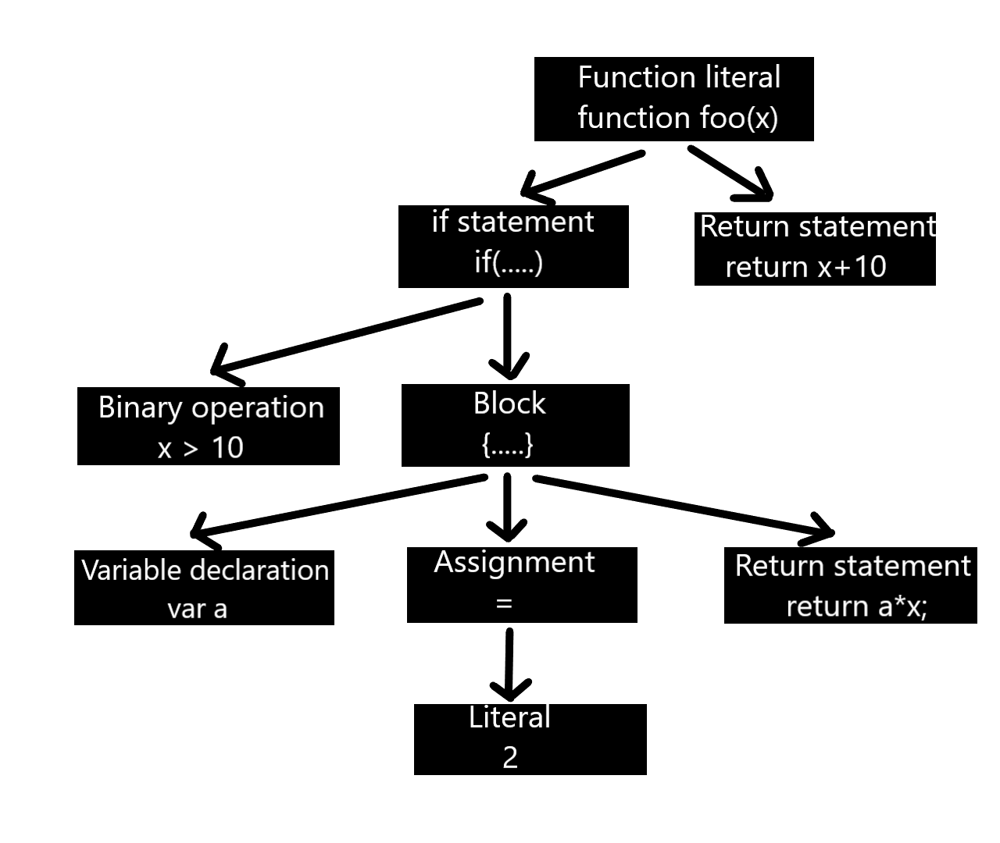
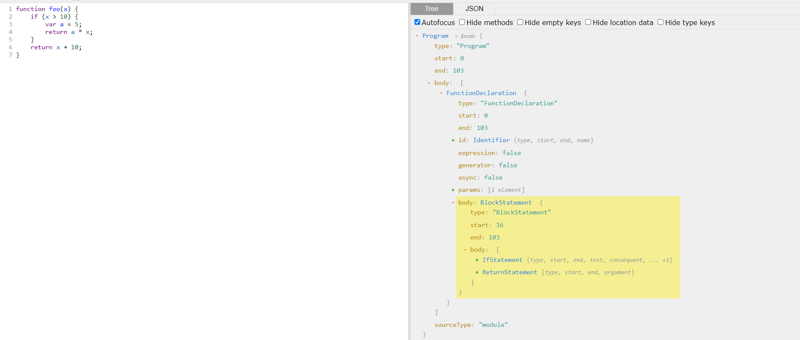

<div align="center">
<h1>nice-linter</h1> 
 
A linter that commends you for making changes in the code that reflect best practices.
 </div>
 
         


 <p align="center">
  <a href="#how-to-use-the-application">How To Use</a> •
  <a href="#features">Features</a> •
  <a href="#team">Team</a>
</p>

## Inspiration
So, a Linter is basically an automated tool that runs on a static piece of code to find any kind of discrepancy arising due to formatting or due to bad coding practices. Running a Linting tool over the source code helps to improve the quality and readability of the code. But what *nice-linter* does is, it basically commends you for making changes in the code that reflect best practices. Because, these little thing must be appreciated as well! You can compare the changes in your code to know how you have switched to follow the best practises while coding in javaScript.

## How we built it

<br>
So let’s take a step back and look at how programming languages work in the first place. No matter what programming language you’re using you’ll always need some piece of software which can take the source code and make the computer actually do something. This software can be either an interpreter or a compiler. No matter whether you’re using an interpreted language or a compiled one , there’s always going to be one common part: *parsing the source code as plain text to a data structure called abstract syntax tree (AST)*. Not only do ASTs present the source code in a structured way but they also play a critical role in the semantic analysis where the compiler validates the correctness and proper usage of the program and the language elements. Later on, the ASTs are used to generate the actual bytecode or machine code.

### JavaScript parsing
For parsing the code in our tool, we have used [espree](https://github.com/eslint/espree0) as the parser,
Let’s look into how an AST gets built. We have a simple JavaScript function as an example:

```bash
function foo(x) {
    if (x > 10) {
        var a = 2;
        return a * x;
    }
    return x + 10;
}
```
The parser will produce the following AST.
<br><br>

<br><br>
This is just for visualization purposes, it is a simplified version of what the parser would produce. The actual AST is much more complex. For JavaScript, an AST is a JavaScript object containing a tree representation of your source. Lets look at the actual AST in the image below:
<br><br>

<br>
### Finding Changes
After we have the AST, we just need to compare the AST's of the previous code and the new code to get the changes. On the basis of comparison then,the linter commends you for making changes in the code that reflect best practices.

## How To Use The Application
To clone and run this application, you'll need [Git](https://git-scm.com) and [Node.js](https://nodejs.org/en/) installed on your computer. From your command line run:
```bash
npm install
```
It downloads a package and it's dependencies. Now run:

```bash
node main.js linters --old=<old-file-path> --new=<new-file-path> 
```

Viola! Now you are done. You should see the comments about the best practises you followed.
## Features
- The tool commends the user if he/she has switched from *let* to *var* for declaring variables.
- Breaking a long function into smaller ones is a good practise. The tool appreciates when you do it!
- It congratulates the user for switching to cameCase style of naming variables. Since, it makes the variable name more descriptive.
- When you convert chaining to optional chaining the tool extrol you!
- The tool praises you if add *use Strict* in your file.
- Normal functions sounds boring. The tool supports you if you convert normal function to an arrow function
- It endroses you, if you convert string concatenation to tempalate literals.
 
## MLH Fellowship(Fall 2021)

> This is an orientation hackathon project made by MLH Fellows - Team 1


## Team

> "Alone we can do so little; together we can do so much."

| S.No. | Name               | Role               | GitHub Username:octocat:                             |
| ----- | ------------------ | ------------------ | ---------------------------------------------------- |
| 1.    | M. Danial Saleem | Sofware Engineer  | [@MDanialSaleem](https://github.com/MDanialSaleem)           |
| 2.    | Nilisha Jaiswal      | Sofware Developer | [@nilisha-jais](https://github.com/nilisha-jais) |
| 3.    | Zina Kamel  | Sofware Engineer | [@Zina-Kamel](https://github.com/Zina-Kamel) |


---
